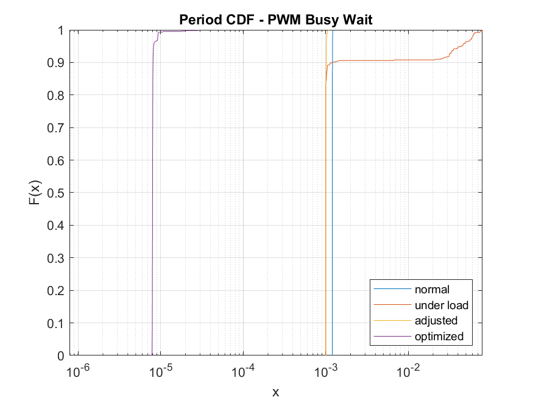
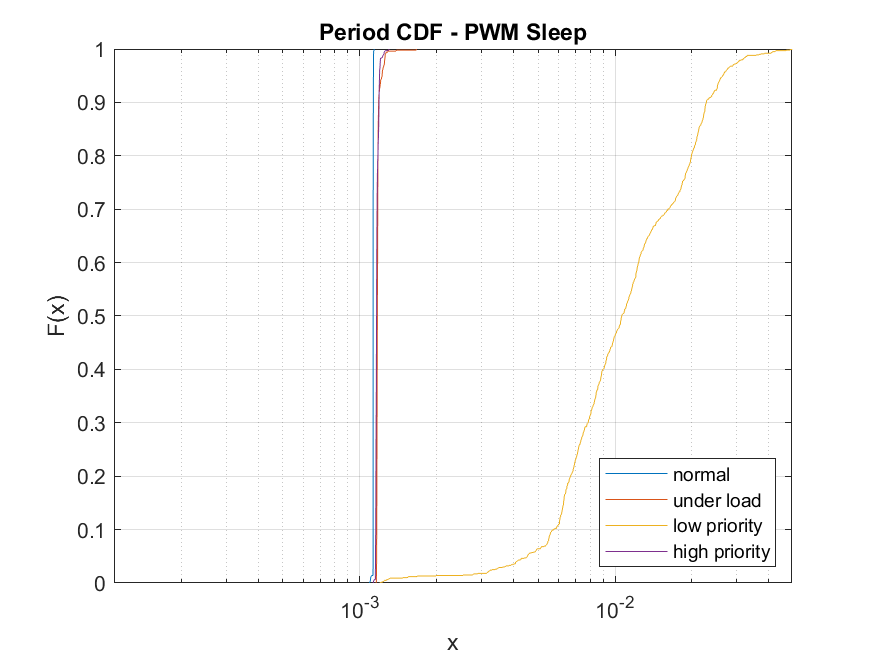
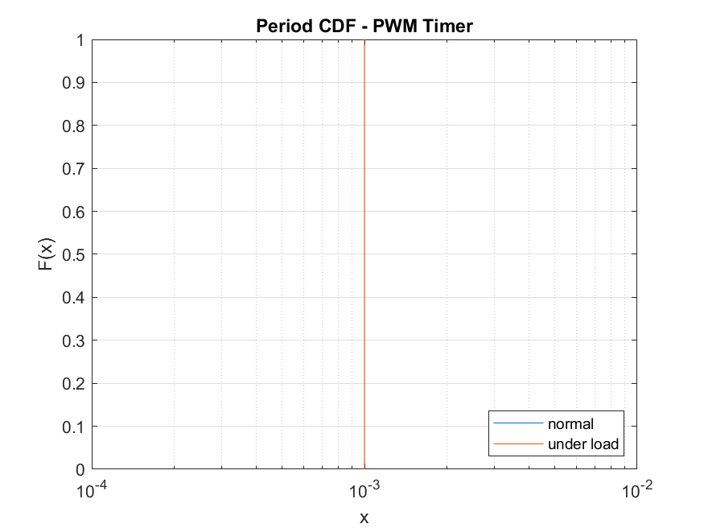

# 🚀 Level 1: Auxiliary Code Generation with AI

Learn how to use AI (e.g., Claude, ChatGPT) to generate complete, functional scripts for specialized tasks such as data analysis, visualization, and processing. This activity demonstrates how AI can help students and educators tackle complex coding tasks that would otherwise require significant manual effort and domain expertise.

---

## 🎓 Pedagogical Framing

- Courses very focused on in-depth topic requiring full attention
    - e.g. [EECE4534](https://neu-ece-4534.github.io) for Linux Kernel Module development in context of advanced embedded sysems
- Requires to hone in and focus on specific details of programming (kernel module development in C)
- Course topic uncovers real-world problems: 
    - Real-time quality of a generated PWM signal? 
    - Directly impacted by the quality of code students write
- Not enough time to also cover out of domain details 
    - Real-time statistical analysis and visualization 
- Opportunity: Prompt AI to generate auxiliary code
- Benefits:
    - Students can focus primary course objectives
    - Analyze and interpret results through generated code
    -> Experiential Learning in a larger context

- Similar opportinities to generate:
    - Simulation code
    - Data loaders, converters
    - Visualizations
    - Diagnostic utilities

---

## 🔍 Example Scenario: Real-time Analysis

- Students develop a kernel module for pulse-width modulation (PWM) signal generation 

- To assess quality of the generated PWM signal, they need to analyze timing data from digital signals
- Students need to capture and analyze, but should not be burdened with implementing the analysis code
- We developed an in-line logic analyzer ([PulseCap](https://neu-ece-4534.github.io/pulsecap.html)) that captures the timing of rising and falling edges of digital signals

### The Challenge:
- Students have captured signal timing data in a comma-separated value (CSV) file:

| **Column** | **Description**                                                       |
|:----------:|:----------------------------------------------------------------------|
|     1      | Sample Time                                                           |
|     2      | Edge type (0 for RISING, 1 for FALLING)                               |
|     3      | Duration since last edge of *same* type (e.g. RISING -\> RISING)      |
|     4      | Duration since last edge of *opposite* type (e.g. FALLING -\> RISING) |


- They need to plot the cumulative probability distribution (CDF) of latency between falling and rising edges
- Being able to plot this using AI, allows me to go to next higher level of understanding of what impacts real-time quality: 
  - Implementation method: busy loop, usleep, hardware timer
  - Scheduling: priority, real-time, best-effort
- Empowers students to learn and reflect about their own code
- Example by students from Spring 2024: 
<div style="display: flex; justify-content: space-between; align-items: flex-start; ">

<div style="flex: 1; text-align: center;">
    
    <br>
    <sub><span style="font-size: 0.8em;"><b>(a) Busy Loop</b></span></sub>
</div>

<div style="flex: 1; text-align: center;">
    
    <br>
    <sub><span style="font-size: 0.8em;"><b>(b) OS Sleep</b></span></sub>
</div>

<div style="flex: 1; text-align: center;">
    
    <br>
    <sub><span style="font-size: 0.8em;"><b>(c) Hardware Timer</b></span></sub>
</div>

</div>

---


## 🤖 Suggested AI Prompt

Upload the CSV file to your AI assistant. 

> **Prompt (manually written):**
> The saved file is a comma separated file with the format outlined in the table below. All time stamps and durations are in seconds.
 Column Description 1 Sample Time 2 Edge type (0 for RISING, 1 for FALLING) 3 Duration since last edge of same type (e.g. RISING -> RISING) 4 Duration since last edge of opposite type (e.g. FALLING -> RISING). Plot cumulative probability of latency between falling and rising edge from this file.

> **Prompt (generated by Sonet 3.7):**
>
> "I need a Python script to analyze timing data from digital signals. I have a CSV file with the following columns:
> 1. Sample Time (in seconds)
> 2. Edge type (0 for RISING, 1 for FALLING)
> 3. Duration since last edge of same type (seconds)
> 4. Duration since last edge of opposite type (seconds)
> 
> Please write a script that:
> 1. Reads the CSV file
> 2. Extracts the latency between falling and rising edges (column 4 when edge type is 0/RISING)
> 3. Calculates and plots the cumulative probability distribution (CDF) of this latency
> 4. Adds appropriate labels, title, and grid to the plot
> 5. Displays some basic statistics (mean, median, min, max, standard deviation)
> 6. Saves the plot as a PNG file
> 
> Please include comments explaining the code and handle potential errors."

---

## Sample Chat

- [Claude Chat](https://claude.ai/artifacts/50104851-e385-4d9c-b0d0-7b4d39e2826f) read-only within Northeastern


## ✅ Sample Generated Script and Output

- generated script: [`analyze_latency.py`](analyze_latency.py) 
- input CSV file: [`pwm_sleep_edges_loaded.csv`](pwm_sleep_edges_loaded.csv)
- output plot: [`pwm_sleep_edges_loaded_latency_cdf.png`](pwm_sleep_edges_loaded_latency_cdf.png)


Below is a sample output image showing the CDF of falling-to-rising edge latency:


This visualization shows the distribution of latencies between falling and rising edges, with vertical lines indicating the mean (red dashed) and median (green dash-dotted) values.

---

## 💡 How to Use the Generated Script

1. **Save the script** as [`analyze_latency.py`](analyze_latency.py) (already provided in this directory)
2. **Install required packages** if necessary:
   ```bash
   pip install pandas numpy matplotlib seaborn
   ```
3. **Run the script** with your CSV file:
   ```bash
   python analyze_latency.py pwm_sleep_edges_loaded.csv
   ```

---

## 🧑‍🏫 Instructor Activity: Enhancing Experiential Learning through Auxillary Code Generation

Now that you've explored how AI tools can generate complete scripts for data analysis, (or simulation, or ...) consider how you might use this approach in your own teaching.

1. **Identify a task beyond your course scope** in your curriculum that typically requires extensive coding, but would enable students to focus on higher-level concepts connecting real-world challenges with their course scope.
2. **Craft a detailed prompt** that would help an AI assistant generate a useful script
3. **Consider how students will learn** from the enabled higher-level analysis/reasoning. 
4. **Plan for assessment** that focuses on understanding and interpretation rather than implementation

This approach allows students to engage with more complex analyses than might otherwise be possible, while still developing their understanding of programming concepts and practices core to the course.
