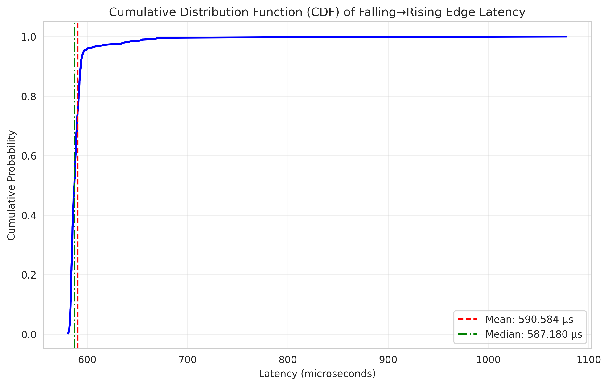

# 🚀 Level 3: Auxiliary Code Generation with AI

### 🎯 Objective:
Learn how to use AI (e.g., Claude, ChatGPT) to generate complete, functional scripts for specialized tasks such as data analysis, visualization, and processing. This activity demonstrates how AI can help students and educators tackle complex coding tasks that would otherwise require significant manual effort and domain expertise.

---

## 🧠 Concept: One-shot Script Generation for Data Analysis

In this activity, we explore how AI can be used to generate complete scripts for specific tasks, particularly data analysis and visualization. Instead of writing code from scratch, we focus on using AI to **transform requirements** into ready-to-use code that students can run, understand, and modify.

---

## 🎓 Pedagogical Framing

The goal isn't to replace students' programming skills, but to:

- **Accelerate complex implementation tasks** so students can focus on higher-level concepts and analysis
- Provide **practical examples of good coding practices** that students can learn from
- Help students **bridge the gap** between theoretical understanding and practical implementation
- Enable **more ambitious projects** that would be too time-consuming to code manually

This approach promotes:
- More time spent on analysis and interpretation rather than implementation details
- Exposure to more advanced programming techniques than students might be ready to write themselves
- A mindset of *focusing on the problem* rather than getting stuck on syntax

---

## 🔍 Example Scenario: Microprocessor Signal Analysis

In this example from a Microprocessor-based Design course, students need to analyze timing data from digital signals. The PulseCap module captures the timing of rising and falling edges, but students need to process and visualize this data to understand signal behavior.

### The Challenge:
- Students have captured signal timing data in a specialized format 
- They need to plot the cumulative probability distribution (CDF) of latency between falling and rising edges
- The analysis requires statistical processing and professional-quality visualization

---

## 📊 Input Data Format

The input data is in CSV format with the following columns:
1. Sample Time (in seconds)
2. Edge type (0 for RISING, 1 for FALLING)
3. Duration since last edge of same type (e.g., RISING → RISING)
4. Duration since last edge of opposite type (e.g., FALLING → RISING)

This data comes from the PulseCap kernel module used for capturing the timing of digital signals at 10ns accuracy.

---

## 🤖 Suggested AI Prompt

To generate a script that can process and visualize this data, you can use the following prompt with an AI assistant (like Claude or ChatGPT):

> **Prompt:**
>
> "I need a Python script to analyze timing data from digital signals. I have a CSV file with the following columns:
> 1. Sample Time (in seconds)
> 2. Edge type (0 for RISING, 1 for FALLING)
> 3. Duration since last edge of same type (seconds)
> 4. Duration since last edge of opposite type (seconds)
> 
> Please write a script that:
> 1. Reads the CSV file
> 2. Extracts the latency between falling and rising edges (column 4 when edge type is 0/RISING)
> 3. Calculates and plots the cumulative probability distribution (CDF) of this latency
> 4. Adds appropriate labels, title, and grid to the plot
> 5. Displays some basic statistics (mean, median, min, max, standard deviation)
> 6. Saves the plot as a PNG file
> 
> Please include comments explaining the code and handle potential errors."

---

## ✅ Sample Generated Script

The AI-generated script is saved as [`analyze_latency.py`](analyze_latency.py) in this directory. The script reads CSV data files like [`pwm_sleep_edges_loaded.csv`](pwm_sleep_edges_loaded.csv), processes the edge timing information, and produces both statistical output and a visualization of the cumulative distribution function (CDF).

### Sample Output Visualization

Below is a sample output image showing the CDF of falling-to-rising edge latency:



This visualization shows the distribution of latencies between falling and rising edges, with vertical lines indicating the mean (red dashed) and median (green dash-dotted) values.

---

## 💡 How to Use the Generated Script

1. **Save the script** as [`analyze_latency.py`](analyze_latency.py) (already provided in this directory)
2. **Install required packages** if necessary:
   ```bash
   pip install pandas numpy matplotlib seaborn
   ```
3. **Run the script** with your CSV file:
   ```bash
   python analyze_latency.py pwm_sleep_edges_loaded.csv
   ```
4. **Review the output** statistics and CDF plot to analyze signal latency

The sample output will look similar to the image shown above. The script provides a foundation that students can further customize for their specific analysis needs.

---

## 💬 Reflection Questions

After using AI to generate this script, consider:

- How would this script need to be modified for different timing characteristics?
- What additional analyses might be valuable for understanding signal behavior?
- How does having a working script impact your ability to focus on interpreting the results rather than implementation details?
- What parts of the code would you have struggled to implement on your own?

---

## 🧑‍🏫 Instructor Activity: Designing an AI-Supported Data Analysis Task

Now that you've explored how AI tools can generate complete scripts for data analysis, consider how you might use this approach in your own teaching.

### 🎓 Your Task:
Design a **classroom activity** where students use an AI assistant to generate a script that processes and analyzes data relevant to your course.

1. **Identify a data-heavy task** in your curriculum that typically requires extensive coding
2. **Craft a detailed prompt** that would help an AI assistant generate a useful script
3. **Consider how students will learn** from analyzing and potentially modifying the generated code
4. **Plan for assessment** that focuses on understanding and interpretation rather than implementation

This approach allows students to engage with more complex analyses than might otherwise be possible, while still developing their understanding of programming concepts and practices.
