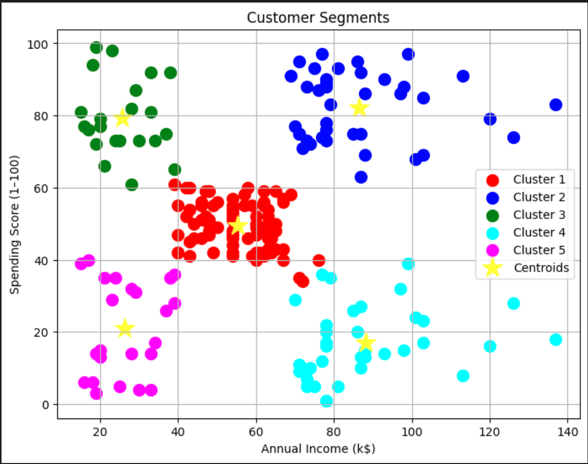
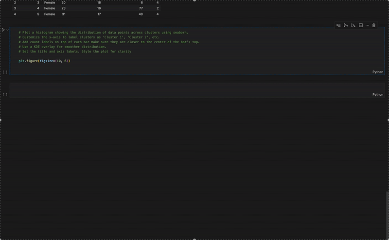

# 🚀 Level 3: Copilot Integration for Code Completion

### 🎯 Objective:
Explore how GitHub Copilot can support students during the coding process by suggesting context-aware completions, generating boilerplate code, and scaffolding code structures based on natural language prompts. This activity focuses on helping students engage more deeply with **design**, **testing**, and **debugging** by letting Copilot handle repetitive coding tasks.

---

## 🎓 Pedagogical Framing

GitHub Copilot isn't just a shortcut for writing code — it's a tool that can support how students **design** their solutions and express their **intent** clearly through code.

Instructors can frame Copilot not as a solution engine, but as a collaborator in the design process:
- Help students translate high-level **intent** ("I want to cluster these points and visualize them") into functional code.
- Encourage learners to focus on the **design** of the overall solution rather than just syntax and boilerplate.

This shifts the emphasis from *"getting the code to run"* to:
- **Designing** robust, readable, and purposeful code
- Reviewing Copilot's suggestions to ensure they align with the student's original **intent**
- Making **critical decisions** about whether to accept, reject, or revise Copilot's completions

Instructors can guide students to use Copilot in a way that reinforces understanding, promotes ownership of code, and supports the development of good coding practices rooted in **design thinking**.

---

## 🧑‍🏫 Instructor Activity: Using Copilot for Code Completion and Design

In this activity, you'll explore how to use GitHub Copilot to support your students during the **design phase** of programming — helping them scaffold code, generate utility functions, and translate their **intent** into structured implementations.

---

### 📊 Example Output: Cluster Visualization

This scatter plot shows the result of clustering customers based on their annual income and spending score using KMeans. A typical classroom activity might involve students analyzing or reproducing such results.

---

### 🤖 Copilot in Action

This GIF demonstrates how GitHub Copilot can autocomplete code when given a well-structured prompt. Students can use it to generate functions like:
- `plot_cluster_distribution(df)`
- `evaluate_clustering_quality(X_scaled, labels)`

---

### 🎯 Your Task

Design a classroom activity where students:
1. **Start from a partially written script** or data processing task.
2. Use **Copilot to complete** functions, generate visualizations, or structure test code.
3. Reflect on how closely Copilot's output matches their original **design intent**.

---

### 💬 Consider:
- What kind of prompt would you give your students?
- How would you ensure they're critically evaluating Copilot's suggestions?
- Could this accelerate their ability to explore real-world datasets?

---

## ✍️ Design Your Classroom Activity Using GitHub Copilot

Use the prompts below to outline a potential activity where students use Copilot to support coding through **design**, **intent-driven completion**, or **automated structure generation**.

---

### 📌 Activity Title:
(e.g., "Visualizing Customer Segments with Copilot")

---

### 🧠 Learning Objective:
What should students understand, design, or build by the end of this activity?

---

### 📂 Starting Point / Scaffold:
What starter code, dataset, or partially written function will you provide?

---

### 💬 Copilot Prompts Students Might Use:
What natural language or inline code comments will guide Copilot's suggestions?

---

### 🧪 Expected Copilot Outputs:
What types of completions or functions do you anticipate Copilot will generate?

---

### 🎯 Assessment Focus:
How will students demonstrate their understanding beyond just running AI-generated code?
(e.g., debugging, editing, documentation, reflection)

---

### 📣 Notes for Facilitator:
Optional tips on how you would guide students during this activity.
